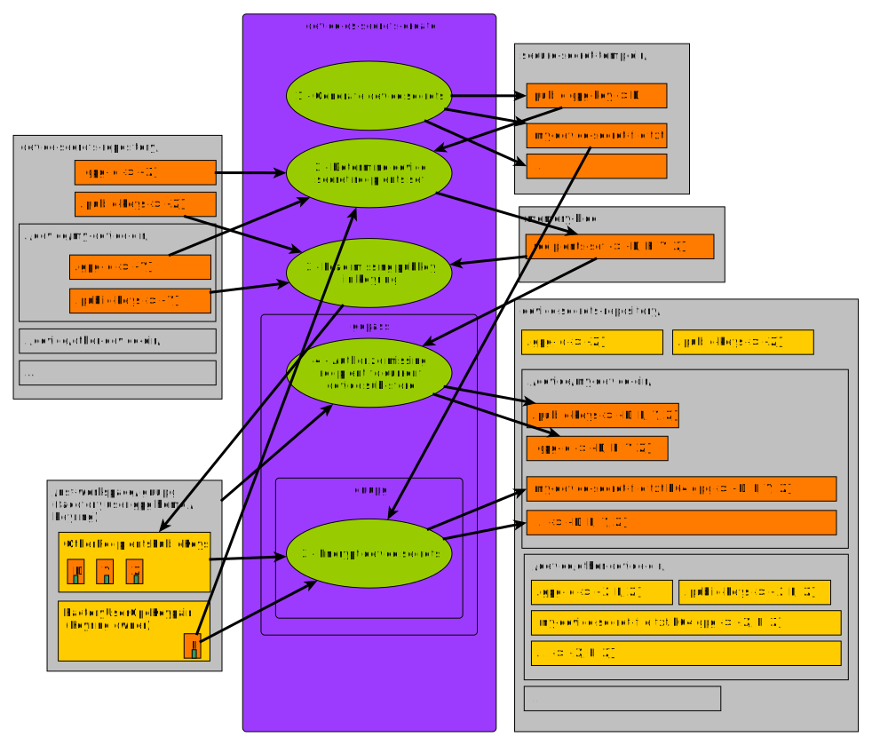

# `device-os-secrets-create`

Create a *target device*'s secret set.

Will fallback to the *current device* if no *target device* specified.

## Settings

 -  `.current-device.yaml`

     -  `identifier`

        Identifies the current / target device when not explicitly specified
        otherwise (e.g: via env. var or parameter).

     -  `gpg-id`

        TODO: Doc its use.

## Env. vars

 -  `NSF_DEVICE_ROOT_USER_GPG_DEFAULT_EXPIRE_DATE`

    The "default* value that will be used when creating a device
    root user's gpg identity.

    One of: {"0", "\<n\>", "\<n\>w", "\<n\>m", "\<n\>y"}

    When unspecified, static default will be "1y".

 -  `NSF_DEVICE_ROOT_USER_GPG_EXPIRE_DATE`

    The value that will be used when creating a device
    root user's gpg identity.

    Has priority over `NSF_DEVICE_ROOT_USER_GPG_DEFAULT_EXPIRE_DATE`.

## Effects

Will:

 -  create the device's sub store directory structure if it does not already
    exist.
 -  mount required gopass stores / sub-store.
 -  import any required gpg public keys in the current factory user's
    keyring.
 -  update authorized gpg user / identity so that it at least include:
     -  the *current device* itself
     -  the current *factory user*
     -  any user / identities with access to the whole store / repository.
 -  create the device's secrets and store these encrypted in the sub-store.

Impacted files:

 -  `./device/$(device-current-state field get identifier)/`
     -  `./.gpg-id`
     -  `./.public-keys/`
     -  `./*.gpg`

## Related diagrams

### Device secrets creation process

## See also

 -  [factory-gpg](./factory-gpg.md)
